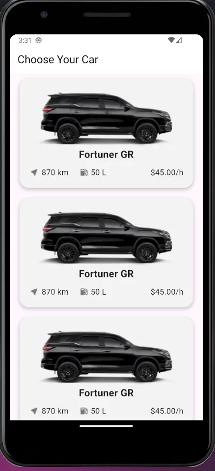
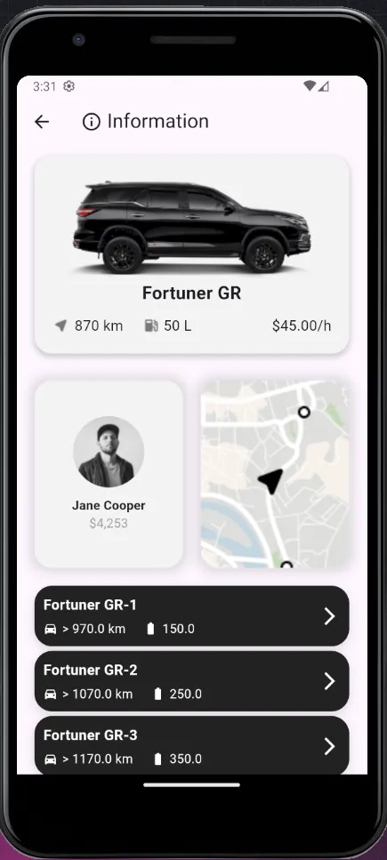
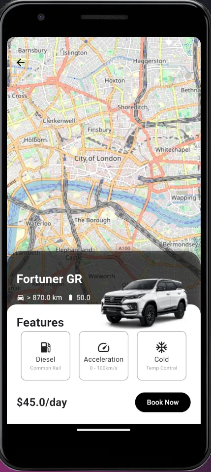

# rent_car_architecture

A Flutter project for premium car rentals.

## Overview

This application provides a platform for renting premium and prestige cars at competitive prices. Users can choose from a variety of high-end vehicles, such as the Fortuner GR, and enjoy features like diesel engines, advanced acceleration, and temperature control.


## Features

- **Car Selection**: Choose from a range of premium cars like the Fortuner GR.
- **Detailed Information**: View specifications such as fuel efficiency (e.g., 870 km per 50L) and rental rates (e.g., $45.00/hour).
- **User Profiles**: Manage rentals with user-specific information (e.g., Jane Cooper).
- **Location-Based Services**: Explore available cars in various locations like Barnsbury, Islington, and Shoreditch.







## Getting Started

This project is a starting point for a Flutter application.

A few resources to get you started if this is your first Flutter project:

- [Lab: Write your first Flutter app](https://docs.flutter.dev/get-started/codelab)
- [Cookbook: Useful Flutter samples](https://docs.flutter.dev/cookbook)

For help getting started with Flutter development, view the
[online documentation](https://docs.flutter.dev/), which offers tutorials,
samples, guidance on mobile development, and a full API reference.

## Example Code

Here's a snippet to illustrate how you might display car information in the app:

```dart
class Car {
  final String model;
  final double mileage;
  final double fuelCapacity;
  final double ratePerHour;

  Car({required this.model, required this.mileage, required this.fuelCapacity, required this.ratePerHour});
}

List<Car> cars = [
  Car(model: 'Fortuner GR', mileage: 870, fuelCapacity: 50, ratePerHour: 45.00),
  // Add more cars as needed
];